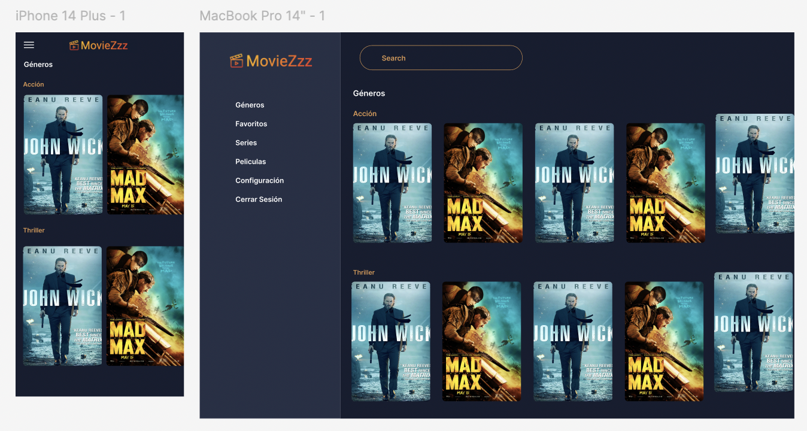
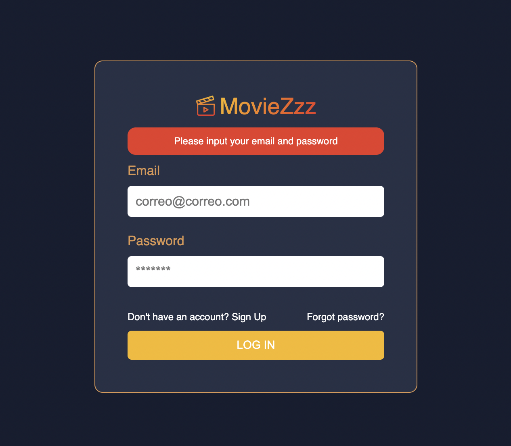
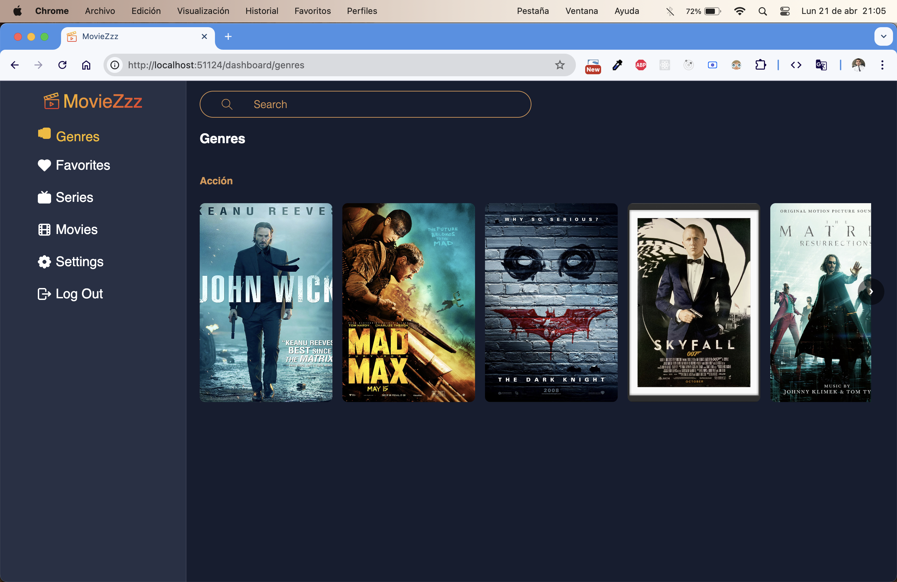
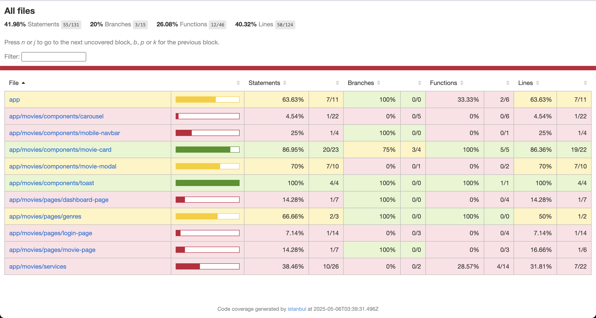
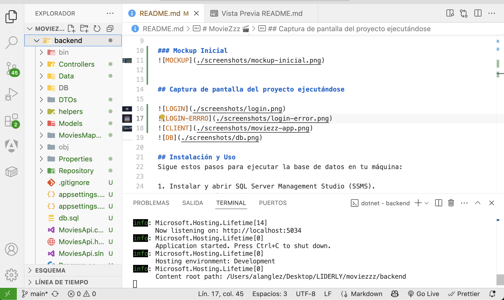
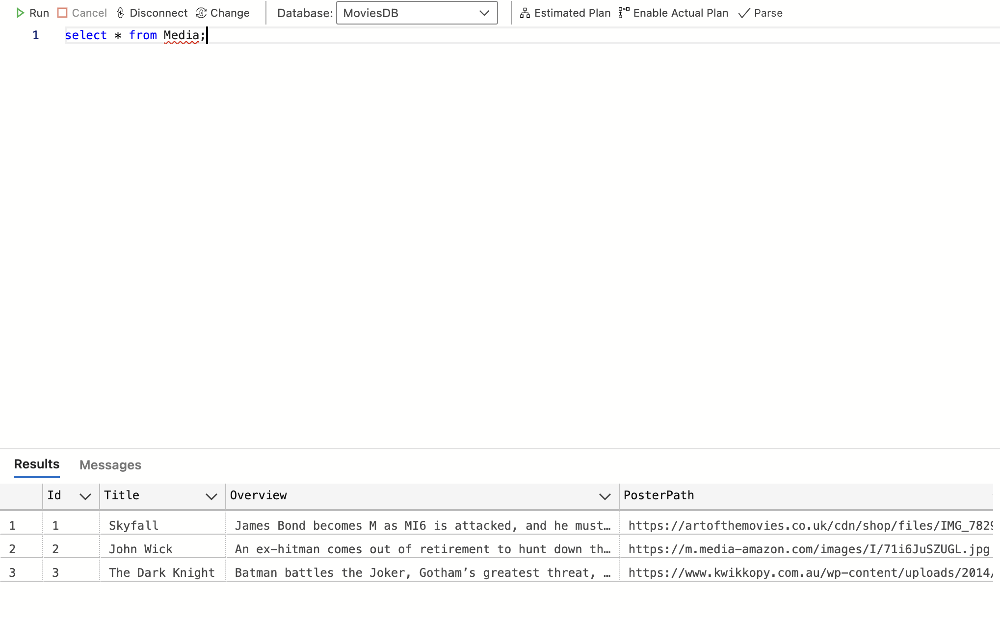
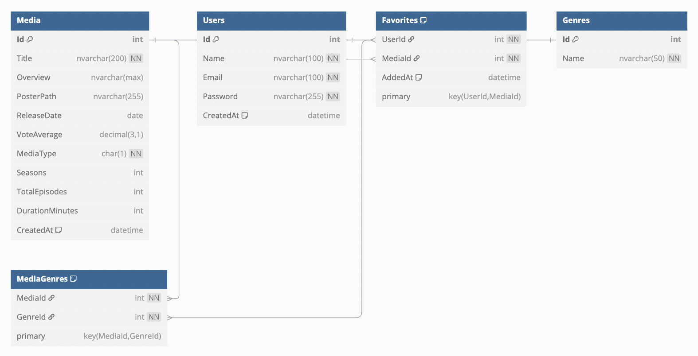
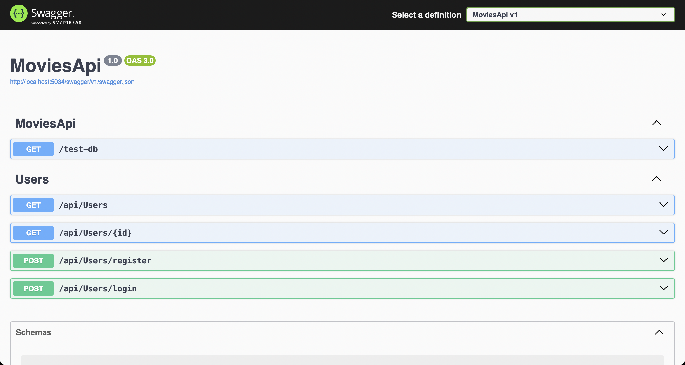

# MovieZzz 🎬  
*Una aplicación para explorar y gestionar tus películas favoritas.*

### Descripción  
MovieZzz es una aplicación de películas que permite a los usuarios explorar títulos, ver detalles y gestionar su lista de favoritos. 

### Objetivo 
Desarrollar una aplicación web tipo SPA (Single Page Application) utilizando Angular, que permita a los usuarios descubrir películas, consultar información detallada y administrar una lista personalizada de títulos favoritos, simulando la experiencia de un servicio de streaming moderno.

### Mockup Inicial 
  

## Captura de pantalla del proyecto ejecutándose 

 
 
 
 
 
  

## Instalación y Uso  

1. Clonar el repositorio

         git clone https://github.com/alanglez45/moviezzz.git
         cd moviezzz

2. Ejecutar el backend (.NET Core)

         cd backend

3. Ejecutar la aplicación:

         dotnet run

4. Ejecutar el frontend (Angular)

         cd ../frontend

5. Instalar dependencias:

         npm install
6. Ejecutar la aplicación:

         ng serve

Sigue estos pasos para ejecutar la base de datos en tu máquina:

1. Instalar y abrir SQL Server Management Studio (SSMS).
2. Conectarse al servidor.
3. Crear la base de datos.
4. Cambiar al contexto de la base de datos.
5. Crear las tablas en el orden correcto.
6. Insertar los datos en el orden correcto.
7. Verificar los datos con consultas básicas.
8. Probar las relaciones con consultas JOIN.

### Dependencias / bibliotecas

### Desarrollo  
Para crear la API, lo primero que hice fue configurar las credenciales de la base de datos en el archivo appsettings.json, donde agregué la cadena de conexión para que la aplicación pudiera comunicarse con la base de datos. Después, configuré el DbContext y lo registré en el archivo Program.cs, junto con los servicios que necesita Entity Framework para que funcionara correctamente.

Luego, comencé a crear los modelos. A partir de ahí, implementé los repositorios, encargados de manejar toda la lógica relacionada con el acceso a datos. Finalmente, desarrollé los controladores, enfocados principalmente en la autenticación, como los endpoints de login y registro, permitiendo que la API reciba y responda solicitudes

### DIAGRAMA DE ENTIDAD-RELACIÓN DE LA BASE DE DATOS
  

### APARTADO DE POSIBLES MEJORAS
- agregar más peliculas a la DB, conectarlas con el frontend

### Documentación de la API - Swagger
http://localhost:5034/swagger/index.html

  

### Problemas conocidos
- Error al intentar conectar la base de datos

### Retrospectiva
  
   1. ¿Qué hice bien?  
   - Configuré bien la conexión a la base de datos y organicé el proyecto separando modelos, repositorios y controladores. Además, implementé correctamente el login y registro para manejar la autenticación.

   2. ¿Qué no salió bien?
   - Me costó un poco manejar las relaciones entre las tablas.

   3. ¿Qué puedo hacer diferente?
   - Mejorar la gestión del tiempo y organizar mejor las tareas para avanzar más rápido y evitar confusiones durante el desarrollo.

