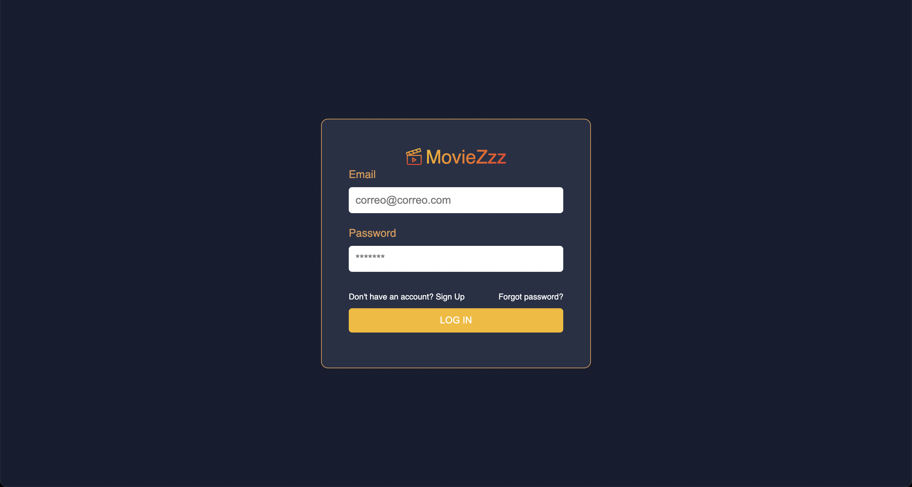
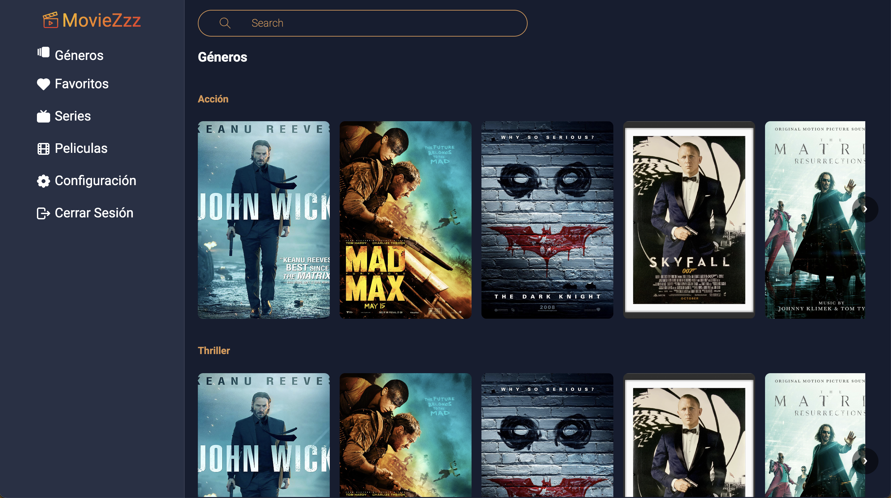
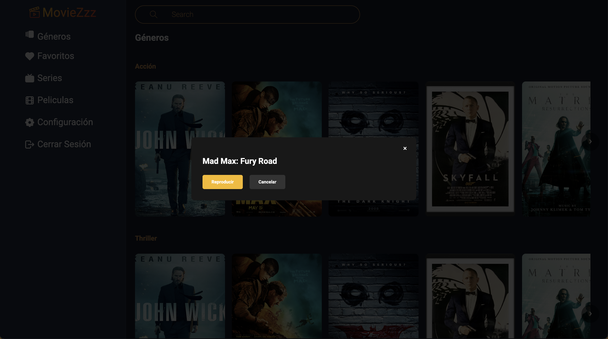
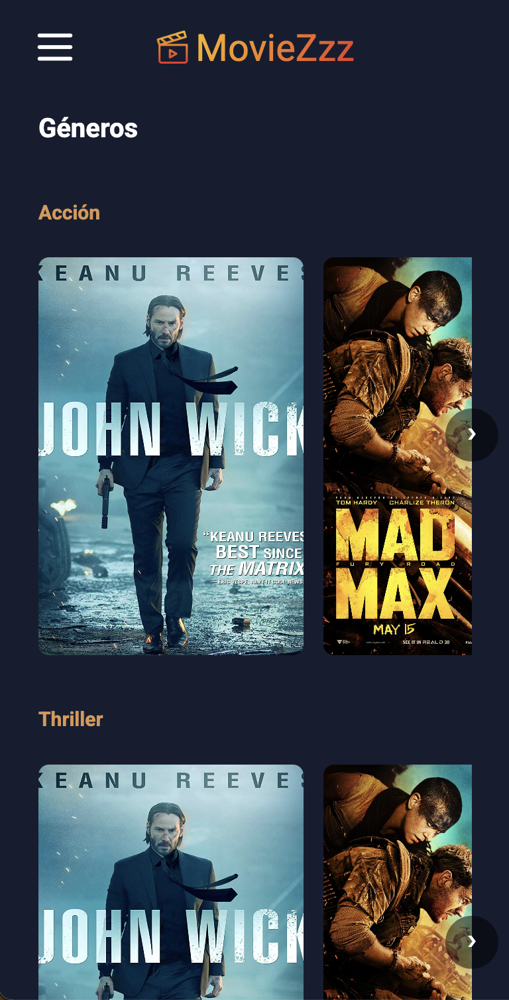
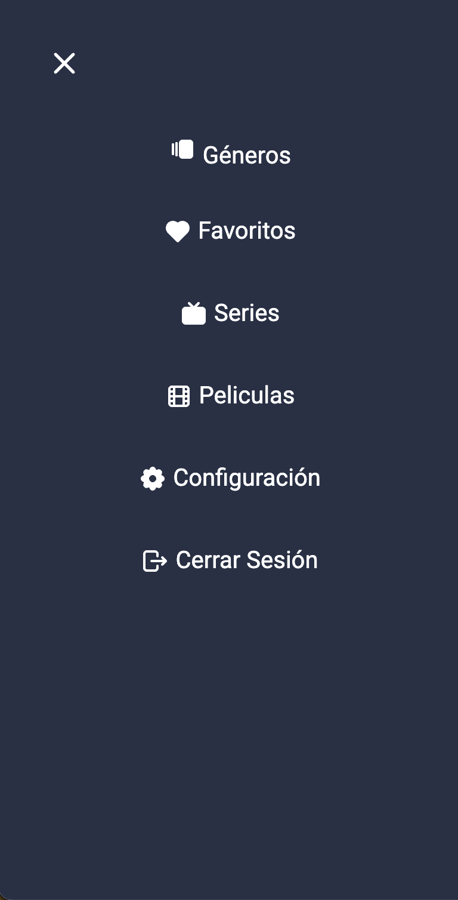

# MovieZzz 🎬  
*Una aplicación para explorar y gestionar tus películas favoritas.*

## Descripción  
MovieZzz es una aplicación de películas que permite a los usuarios explorar títulos, ver detalles y gestionar su lista de favoritos. 

## Capturas de pantalla  
Login
  

Desktop
  

Ver película - Desktop
 

Ocultar película - Desktop
 

Mobile
  

Navbar - Mobile 
 

Ocultar película – Mobile
  

## Mockup  
https://www.figma.com/design/YWUWeiVRIMYjuk26dObyXx/MovieZzz?node-id=0-1&t=5MK18C6wciyMtjUf-1

## Instalación y Uso  
Sigue estos pasos para ejecutar MovieZzz en tu máquina:

1. Clona el repositorio:  
   ```sh
   git clone https://github.com/alanglez45/moviezzz.git
   cd moviezzz


## Desarrollo  
Primero me inspiré en diversas plataformas de streaming para entender cómo organizan el contenido y el diseño la interfaz. Luego elegí una paleta de colores oscuros con toques vibrantes para crear un ambiente cinemático. Hice un primer diseño básico en Figma para definir la estructura y los componentes principales. Al pasar al código, fui mejorando los detalles: ajusté espaciados, pulí las animaciones y añadí funcionalidades como el toast de confirmación. Aunque partí de referencias existentes, le di mi toque personal con el diseño minimalista y la experiencia de usuario simplificada. Cada iteración me ayudó a entender mejor cómo combinar diseño y funcionalidad.

## Problemas conocidos
- 🛠 Falta implementar la función de favoritos, series, películas etc.


## Retrospectiva
  
   1. ¿Qué hice bien?  
   - Logré estructurar correctamente la aplicación utilizando CSS y HTML, asegurando una presentación clara y bien organizada.
   2. ¿Qué no salió bien?
   - No tuve mayores problemas, pero me di cuenta de que había olvidado algunos conceptos clave del DOM, lo que me hizo repasar ciertos aspectos.
   3. ¿Qué puedo hacer diferente?
   - Seguir practicando y reforzando mis conocimientos sobre el DOM, además de mantener un hábito constante de estudio y mejora en desarrollo web.
